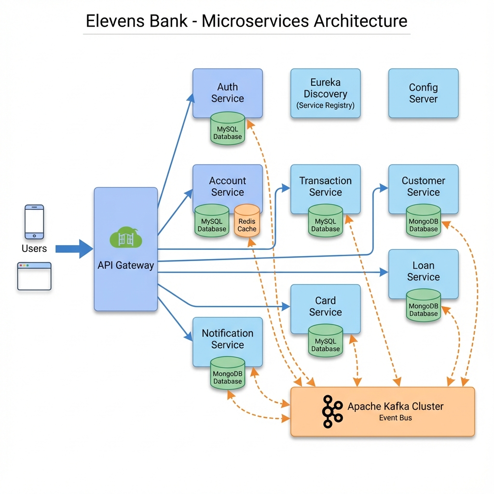
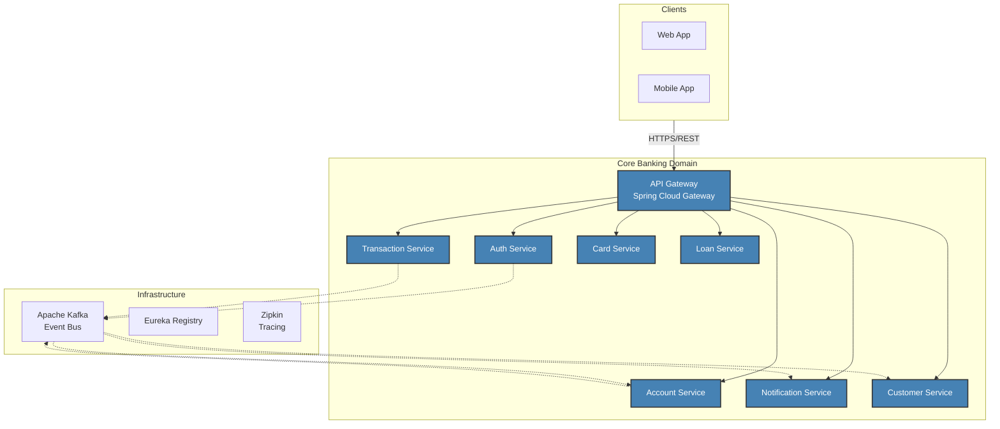

<div align="center">
  
  
  <h1>🏦 Elevens Bank — Next-Gen Microservices Platform</h1>

  <p>
    <strong>Event-driven, Cloud-Native Banking System built for Scale, Resilience, and Security.</strong>
  </p>

  <p>
    <a href="https://spring.io/projects/spring-boot"></a>
    <a href="https://spring.io/projects/spring-cloud"></a>
    <a href="https://kafka.apache.org/"></a>
    <a href="https://www.docker.com/"></a>
    <a href="#"></a>
  </p>
</div>

---

## 📖 Introduction

**Elevens Bank** is a reference architecture for a modern, distributed banking system. It demonstrates how to build scalable, fault-tolerant financial applications using **Java 21** and the **Spring Ecosystem**.

The system implements advanced patterns like **SAGA** for distributed transactions, **CQRS** for high-performance reads, and **Event-Driven Architecture** for decoupling services. It is fully observable with **Distributed Tracing** (OpenTelemetry + Zipkin) and documented via **OpenAPI/Swagger**.

---

## 🚀 Key Features

- **🔐 Advanced Security**: OAuth2 Resource Server implementation with JWT-based authentication and Role-Based Access Control (RBAC).
- **🔄 Event-Driven Architecture**: Asynchronous communication using Apache Kafka for high throughput and service decoupling.
- **⚡ Distributed Transactions**: SAGA Choreography pattern ensures data consistency across microservices without a central coordinator.
- **🛡️ Resilience Patterns**: Circuit Breakers, Rate Limiting, Retries, and Bulkheads implemented using Resilience4j.
- **📡 Observability**: Full distributed tracing with Micrometer & OpenTelemetry, exporting traces to Zipkin.
- **📄 API-First Design**: Contract-first development with OpenAPI specifications and automated code generation.
- **🐳 Cloud-Native**: Dockerized services ready for Kubernetes deployment.

---

## 🏗️ System Architecture

### C4 Container View
The following diagram illustrates the high-level architecture and communication flows between services.





---

## 🛠️ Technology Stack

| Category | Technologies |
|----------|--------------|
| **Core Framework** | Java 21, Spring Boot 3.3, Spring Cloud 2023 |
| **Communication** | REST, GraphQL, Apache Kafka (Events), Spring Cloud OpenFeign |
| **Data Persistence** | MySQL (Transactional), MongoDB (Read Models/Logs) |
| **Security** | Spring Security 6, OAuth2, JWT |
| **Resilience** | Resilience4j, Spring Cloud Circuit Breaker |
| **Observability** | Micrometer Tracing, OpenTelemetry, Zipkin, Spring Boot Actuator |
| **Infrastructure** | Docker, Docker Compose, Netflix Eureka |

---

## 📦 Microservices Landscape

| Service | Port | Description | Swagger UI |
|:--------|:----:|:------------|:-----------|
| **API Gateway** | `9190` | Edge server, Routing, Rate Limiting | - |
| **Discovery Server** | `8761` | Service Registry (Eureka) | - |
| **Auth Service** | `7001` | JWT Issuance, User Management | [Link](http://localhost:7001/swagger-ui.html) |
| **Account Service** | `3001` | Account mgmt, Balance checks | [Link](http://localhost:3001/swagger-ui.html) |
| **Transaction Service**| `4001` | Money transfers, SAGA Orchestration | [Link](http://localhost:4001/swagger-ui.html) |
| **Cards Service** | `2001` | Credit/Debit card lifecycle | [Link](http://localhost:2001/swagger-ui.html) |
| **Loan Service** | `8001` | Loan processing & repayment | [Link](http://localhost:8001/swagger-ui.html) |
| **Customer Service** | `6001` | KYC, Customer Profiles | [Link](http://localhost:6001/swagger-ui.html) |
| **Notification Service**| `5001` | SMS/Email Alerts (Kafka Consumer) | [Link](http://localhost:5001/swagger-ui.html) |

---

## ⚡ Getting Started

### Prerequisites
- **Java 21 LTS**
- **Docker & Docker Compose**
- **Maven 3.9+**

### Quick Start
1.  **Clone the Repository**
    ```bash
    git clone https://github.com/shrikar-dev/elevens-bank.git
    cd elevens-bank
    ```

2.  **Start Infrastructure (Kafka, Zookeeper, Zipkin, DBs)**
    ```bash
    docker-compose up -d
    ```

3.  **Build & Run Services** (Example for Auth Service)
    ```bash
    cd auth-service
    mvn spring-boot:run
    ```
    *Repeat for other services or use a script to start all.*

---

## 🔍 Observability (Distributed Tracing)

We use **Micrometer Tracing** with **OpenTelemetry** to trace requests across microservices.

1.  **Generate Traffic**: Make API calls via Swagger or Postman.
2.  **Visualize Traces**: Open Zipkin UI at [http://localhost:9411](http://localhost:9411).
3.  **Find Trace**: Look for trace IDs to see the full request journey (e.g., Gateway → Auth → Account → Kafka → Notification).

---

## 🛡️ Security Architecture

The security module uses a **Stateless Authentication** mechanism:
1.  **Login**: User authenticates with `Auth Service` and receives a **JWT**.
2.  **Access**: All subsequent requests to the `API Gateway` must include the JWT in the `Authorization` header (`Bearer <token>`).
3.  **Validation**: The Gateway and downstream services validate the JWT signature and claims (Roles/Scopes).

---

## 👤 Author

**Shrikar**  
*Senior Java Developer*  
Expert in Building Scalable Distributed Systems.  

[](https://www.linkedin.com/in/shrikar-dev) [](mailto:mukesh.shrikar7@gmail.com)

---

<p align="center">
  Built with ❤️ by the Elevens Bank Team.
</p>
