Perfect ✅ Here's your **enhanced, production-grade `README.md`** for
🏦 **Elevens Bank — Financial Microservices Architecture**
This version includes all improvements (C4 component views, resilience, data consistency, security, observability, CI/CD, naming conventions, and author details).

---

````markdown
# 🏦 Elevens Bank — Financial Microservices Architecture

> **Event-driven, Cloud-Native Banking Platform** built with Spring Boot, Spring Cloud, and Apache Kafka  
> Designed for scalability, high availability, and strong data consistency using **SAGA** and **CQRS** patterns.

---

## 📘 Table of Contents
- [1. Overview](#1-overview)
- [2. Architecture (C4 Container View)](#2-architecture-c4-container-view)
- [3. Component View Example (Transaction Service)](#3-component-view-example-transaction-service)
- [4. Key Communication Flows](#4-key-communication-flows)
- [5. SAGA Transaction Flow (Sequence Diagram)](#5-saga-transaction-flow-sequence-diagram)
- [6. Data Consistency Patterns](#6-data-consistency-patterns)
- [7. Resilience & Fault Tolerance](#7-resilience--fault-tolerance)
- [8. Security Overview](#8-security-overview)
- [9. Observability & Monitoring](#9-observability--monitoring)
- [10. CI/CD Pipeline Example](#10-cicd-pipeline-example)
- [11. Technology Stack](#11-technology-stack)
- [12. Implementation Roadmap (4 Weeks)](#12-implementation-roadmap-4-weeks)
- [13. Service Responsibilities](#13-service-responsibilities)
- [14. Kafka Topics & Naming Convention](#14-kafka-topics--naming-convention)
- [15. Getting Started](#15-getting-started)
- [16. Future Enhancements](#16-future-enhancements)
- [17. License](#17-license)
- [18. Author](#18-author)

---

## 1. Overview

**Elevens Bank** is a modular, microservices-based financial system implementing **event-driven architecture** with **Spring Cloud** and **Apache Kafka**.  
Each service owns its database, ensuring **strong data consistency**, **fault isolation**, and **scalability**.  

**Key Features:**
- ✅ JWT-based authentication & authorization  
- ✅ SAGA orchestration for distributed transactions  
- ✅ Reactive event streaming with Kafka  
- ✅ Centralized logging & notification delivery  
- ✅ Resilient and fault-tolerant microservices  

---

## 2. Architecture (C4 Container View)

### 🧩 System Overview Diagram (C4 Container View)

```mermaid
flowchart TB
    subgraph Clients[Client Applications]
        WebApp[Web App]
        MobileApp[Mobile App]
    end

    Clients -->|HTTP/REST| APIGateway

    subgraph Core[Core Microservices]
        APIGateway[API Gateway\n(Spring Cloud Gateway)]
        AuthService[Auth Service\n(Spring Boot + MySQL)]
        CustomerService[Customer Service\n(Spring Boot + MongoDB)]
        AccountService[Account Service\n(Spring Boot + MySQL)]
        TransactionService[Transaction Service\n(Spring Boot + MySQL)]
        CardService[Card Service\n(Spring Boot + MySQL)]
        LoanService[Loan Service\n(Spring Boot + MongoDB)]
        NotificationService[Notification Service\n(Spring Boot + MongoDB)]
    end

    subgraph Infra[Infrastructure]
        Eureka[Eureka Discovery Service]
        Kafka[Kafka Cluster\n(Confluent Platform)]
    end

    APIGateway --> AuthService
    APIGateway --> CustomerService
    APIGateway --> AccountService
    APIGateway --> TransactionService
    APIGateway --> CardService
    APIGateway --> LoanService
    APIGateway --> NotificationService

    AuthService -->|Publishes user-events| Kafka
    TransactionService -->|Publishes txn-commands| Kafka
    AccountService -->|Publishes txn-events| Kafka
    LoanService -->|Publishes loan-events| Kafka
    CardService -->|Publishes card-status| Kafka

    Kafka -->|Consumes events| NotificationService
    Kafka -->|Consumes user-events| CustomerService
    Kafka -->|Consumes txn-commands| AccountService
    Kafka -->|Consumes txn-events| TransactionService

    Eureka -.-> Core
```

---

## 3. Component View Example (Transaction Service)


**Responsibilities:**
- Handles REST endpoints (`/transactions`)
- Publishes `DebitAccountCommand` and listens to `DebitSuccessfulEvent`
- Persists transaction status in MySQL

---

## 4. Key Communication Flows

| Type                     | Description                                                     | Example                                     |
| ------------------------ | --------------------------------------------------------------- | ------------------------------------------- |
| **Synchronous (HTTP)**   | Through API Gateway for direct requests                         | `GET /customers/{id}` (REST) / `POST /graphql` (GraphQL)    |
| **Asynchronous (Kafka)** | For distributed transactions & events                           | `txn-commands`, `txn-events`, `user-events` |
| **SAGA Pattern**         | Transaction coordination using event choreography               | Withdrawals, transfers                      |
| **Event Notification**   | Any service publishes an event → Notification Service processes | `txn-success`, `loan-approved`              |

---

## 5. SAGA Transaction Flow (Sequence Diagram)

```mermaid
sequenceDiagram
    participant User
    participant TransactionService
    participant Kafka
    participant AccountService
    participant NotificationService

    User->>TransactionService: POST /transactions/withdraw (amount=₹500)
    TransactionService->>Kafka: Publish DebitAccountCommand (txnId=TXN123)
    
    Kafka->>AccountService: Consume DebitAccountCommand
    AccountService->>AccountService: Verify balance & debit account
    
    alt Debit Successful
        AccountService->>Kafka: Publish DebitSuccessfulEvent (txnId=TXN123)
        Kafka->>TransactionService: Consume DebitSuccessfulEvent
        TransactionService->>TransactionService: Update txn_status=SUCCESS
        TransactionService->>Kafka: Publish TransactionCompletedEvent
        Kafka->>NotificationService: Consume TransactionCompletedEvent
        NotificationService->>NotificationService: Send email/SMS to user
    else Debit Failed
        AccountService->>Kafka: Publish DebitFailedEvent (txnId=TXN123)
        Kafka->>TransactionService: Consume DebitFailedEvent
        TransactionService->>TransactionService: Update txn_status=FAILED
        TransactionService->>Kafka: Publish TransactionFailedEvent
        Kafka->>NotificationService: Consume TransactionFailedEvent
        NotificationService->>NotificationService: Notify user of failure
    end
```



---

## 6. Data Consistency Patterns

| Area | Pattern | Mechanism |
|------|----------|-----------|
| Cross-service transactions | **SAGA** | Event choreography via Kafka |
| Event reliability | **Outbox Pattern** | DB Outbox + Kafka transactional producer |
| Event ordering | **Key-based partitioning** | Partition key = `txnId` |
| Read model sync | **CQRS** | MongoDB read models |

---

## 7. Resilience & Fault Tolerance

| Service | Pattern | Library |
|----------|----------|----------|
| API Gateway | Rate Limiting + Circuit Breaker | Spring Cloud Gateway Filters + Resilience4j |
| Account Service | - | - |
| Transaction Service | Retry + Bulkhead | Resilience4j |
| Notification Service | Dead Letter Topic (DLT) | Kafka DLT Mechanism |

---

## 8. Security Overview


✅ **Highlights:**
- JWT-based authentication  
- OAuth2 Resource Server for token validation  
- Role-based access control via `@PreAuthorize`  

---

## 9. Observability & Monitoring

| Capability | Tool |
|-------------|------|
| Metrics | Prometheus |
| Logs | ELK Stack (ElasticSearch + Logstash + Kibana) |
| Tracing | OpenTelemetry + Jaeger |
| Health checks | `/actuator/health` endpoints |

---

## 10. CI/CD Pipeline Example

```yaml
# .github/workflows/build.yml
name: Build and Deploy
on: [push]
jobs:
  build:
    runs-on: ubuntu-latest
    steps:
      - uses: actions/checkout@v3
      - name: Set up JDK 17
        uses: actions/setup-java@v3
        with:
          java-version: '17'
      - name: Build with Maven
        run: mvn clean install -DskipTests
      - name: Docker Build
        run: docker build -t elevens-bank-api-gateway ./api-gateway
```

---

## 11. Technology Stack

| Layer | Technologies |
|-------|---------------|
| **Backend** | Spring Boot 3.x, Spring WebFlux, Spring Data JPA, Spring Security, Spring GraphQL |
| **Infra** | Spring Cloud Gateway, Eureka Discovery, Config Server |
| **Event Streaming** | Apache Kafka |
| **Databases** | MySQL, MongoDB |
| **Auth** | JWT, OAuth2 |
| **Containerization** | Docker, Kubernetes |
| **CI/CD** | Maven, Jenkins, GitHub Actions |
| **Monitoring** | ELK Stack, Prometheus, Grafana |

---

## 12. Implementation Roadmap (4 Weeks)

| Phase | Week | Services | Key Deliverables |
|--------|------|-----------|------------------|
| **Phase 1** | Week 1 | Gateway, Eureka, Auth | JWT, Routing, `UserCreated` event |
| **Phase 2** | Week 2 | Customer, Account | CRUD + consume `user-events` |
| **Phase 3** | Week 3 | Transaction, Card | Withdrawals (SAGA flow) |
| **Phase 4** | Week 4 | Loan, Notification | Loan logic + centralized alerts |

---

## 13. Service Responsibilities

| Service | Responsibilities |
|----------|------------------|
| **Auth Service** | Manage users, JWT tokens, publish `UserCreated` |
| **Customer Service** | Manage KYC, consume `UserCreated` |
| **Account Service** | Handle debit/credit, consume `txn-commands` |
| **Transaction Service** | Initiate transfers, publish/consume events |
| **Card Service** | Manage card lifecycle |
| **Loan Service** | Handle disbursements & repayments |
| **Notification Service** | Consume all events & notify users |

---

## 14. Kafka Topics & Naming Convention

| Topic | Producer | Consumer | Description |
|--------|-----------|-----------|--------------|
| `bank.user.event.v1` | Auth Service | Customer Service | User creation events |
| `bank.txn.command.v1` | Transaction Service | Account Service | Transaction commands |
| `bank.txn.event.v1` | Account Service | Transaction, Notification | Transaction results |
| `bank.loan.event.v1` | Loan Service | Account, Notification | Loan updates |
| `bank.card.status.v1` | Card Service | Notification | Card updates |
| `bank.notification.event.v1` | All Services | Notification | Unified alert stream |

---

## 15. Getting Started

### 🧱 Prerequisites
- Java 17+
- Maven 3.9+
- Docker & Docker Compose
- Kafka & Zookeeper (via Confluent or Docker)

### 🚀 Setup
```bash
git clone https://github.com/<your-org>/elevens-bank.git
cd elevens-bank

# Start Kafka & Zookeeper
docker-compose up -d kafka zookeeper

# Start Eureka and API Gateway
cd eureka-server && mvn spring-boot:run
cd ../api-gateway && mvn spring-boot:run

# Start microservices
cd ../auth-service && mvn spring-boot:run
cd ../customer-service && mvn spring-boot:run
```

### 🧪 Sample Endpoints
```bash
# Register a user
POST /auth/register
{
  "email": "john.doe@example.com",
  "password": "password123"
}

# Open a new account
POST /accounts
{
  "customerId": "CUST1001",
  "initialBalance": 5000
}
```

---

## 16. Future Enhancements


- Introduce **Audit Logging Service** for compliance  
- Enable **OpenTelemetry tracing** across all services  
- Introduce **Kubernetes Helm charts** for deployment  

---

## 17. License

Licensed under the **MIT License** — free to use, modify, and distribute with attribution.

---

## 18. Author

👨‍💻 **Shrikar**  
**Senior Java Developer @ Cognizant**  
Expert in Spring Boot • Kafka • Microservices • Cloud-Native Architectures  
📧 [mukesh.shrikar7@gmail.com](mailto:mukesh.shrikar7@gmail.com)  
🌐 [LinkedIn](https://www.linkedin.com/in/shrikar-dev)

---
````

