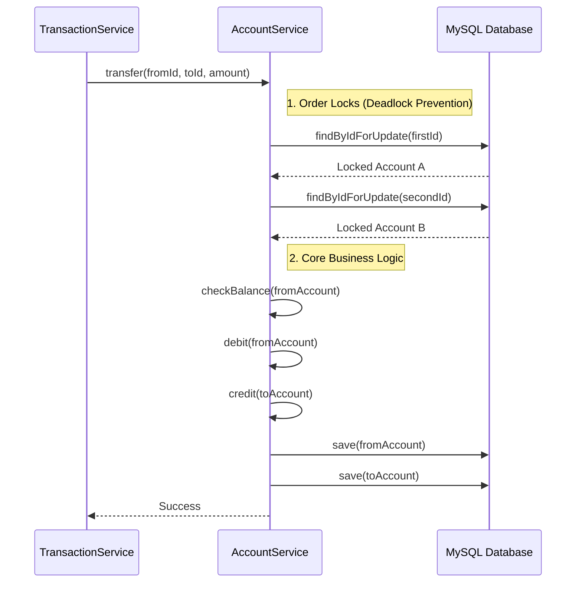
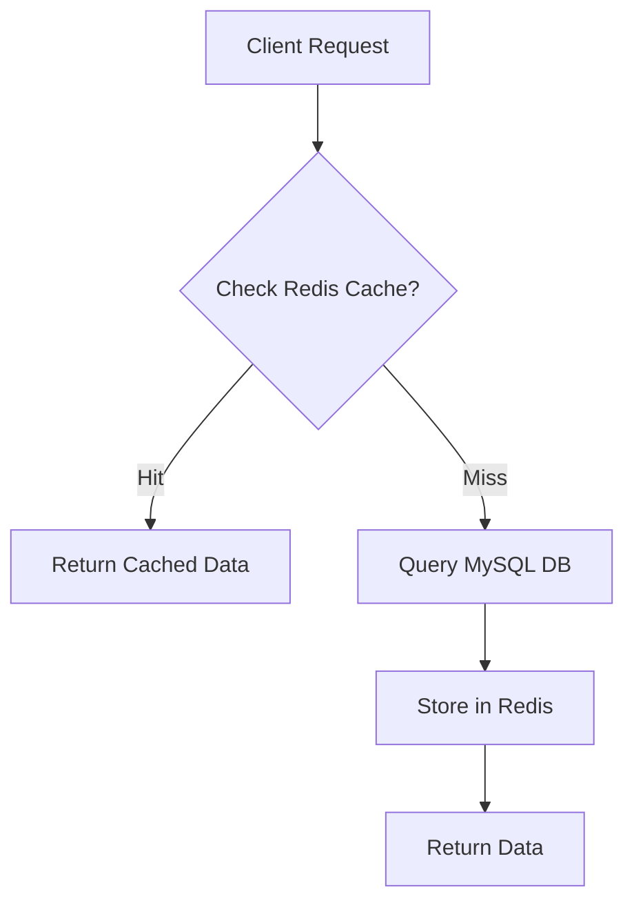

# Account Service

## Overview
The `account-service` is the core banking ledger. It manages user accounts, balances, and executes atomic financial operations. It is designed for high consistency (ACID) and high read throughput.

## Key Features
- **Account Management**: Create, Read, Update, Delete (CRUD) for accounts.
- **Caching**: Uses **Redis** (Look-aside pattern) to cache account details (`@Cacheable`).
- **Concurrency Control**: Implements **Pessimistic Locking** (`select for update`) for safe money transfers.
- **Optimistic Locking**: Uses `@Version` to prevent lost updates on entity modifications.

## Tech Stack
- **Database**: MySQL (Relational, ACID compliant)
- **Caching**: Redis
- **Framework**: Spring Data JPA

## Flow Diagrams

### 1. Money Transfer Flow (Internal)
This flow illustrates how the service handles concurrency during a transfer.

### 2. Get Account (Caching Strategy)

