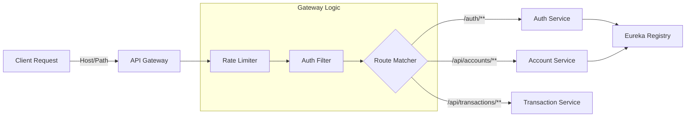
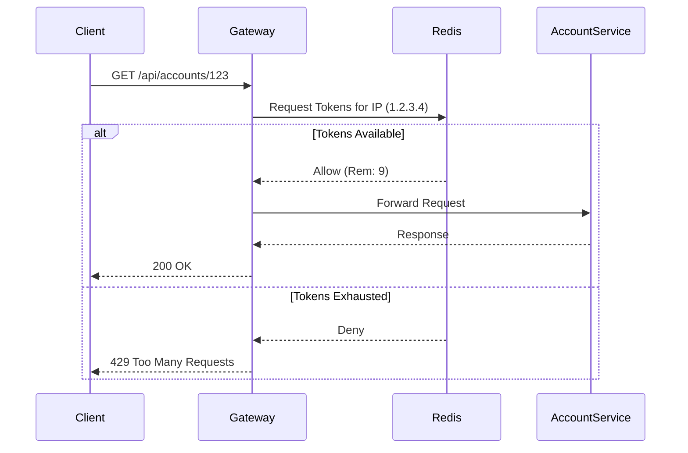

# API Gateway

## Overview
The `api-gateway` is the single entry point for all client requests. It intelligently routes traffic to the appropriate microservices while providing cross-cutting concerns like security, rate limiting, and observability.

## Key Features
- **Dynamic Routing**: Uses **Spring Cloud Gateway** to route requests based on paths (e.g., `/auth/**` -> `auth-service`).
- **Service Discovery**: Integrates with **Eureka** to resolve service locations dynamically (`lb://service-name`).
- **Rate Limiting**: Implements **Token Bucket Algorithm** using Redis to prevent abuse (e.g., 10 req/s per IP).
- **Security**: Validates JWT tokens for protected routes.
- **Circuit Breaker**: Resilience4j integration to fail fast if downstream services are down.

## Tech Stack
- **Framework**: Spring Cloud Gateway (Reactive)
- **Discovery**: Netflix Eureka Client
- **Rate Limiting**: Redis Reactive Rate Limiter
- **Tracing**: Zipkin/Sleuth

## Flow Diagrams

### Request Routing Flow

### Rate Limiting Logic (Token Bucket)

