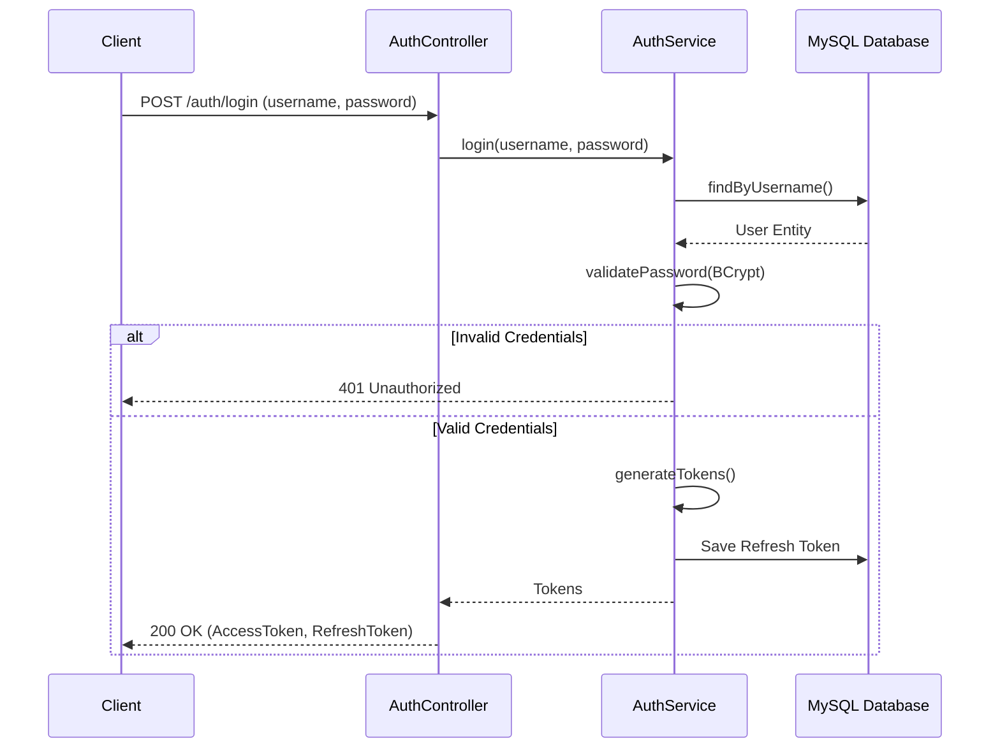
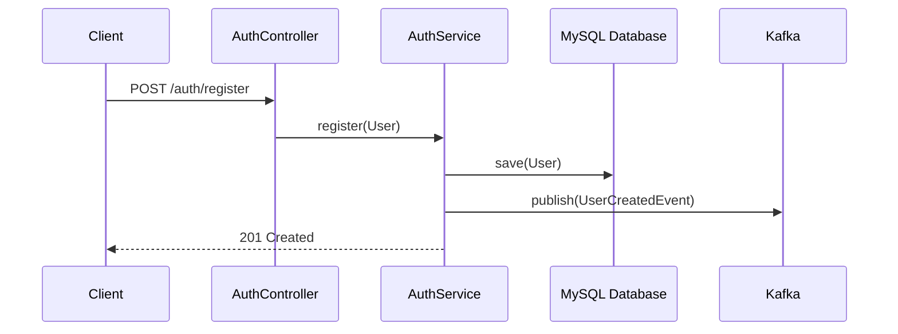

# Auth Service

## Overview
The `auth-service` handles user registration, authentication, and token management. It uses **JWT (JSON Web Tokens)** for stateless authentication across the microservices ecosystem. It also publishes events using **Kafka** upon user creation.

## Key Features
- **Registration**: Creates new users and hashes passwords using **BCrypt**.
- **Login**: Validates credentials and issues an Access Token (15m validity) and Refresh Token.
- **Token Refresh**: Rotates access tokens using a valid refresh token.
- **Event Publishing**: Publishes `UserCreatedEvent` to Kafka topic `bank.user.event.v1`.

## Tech Stack
- **Languages**: Java 21, Spring Boot 3
- **Security**: Spring Security, JWT (JJWT library)
- **Database**: MySQL (User/Role data), Redis (optional for session revocation)
- **Messaging**: Kafka

## Flow Diagrams

### 1. User Login Flow

### 2. Registration Flow

