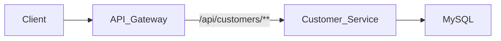
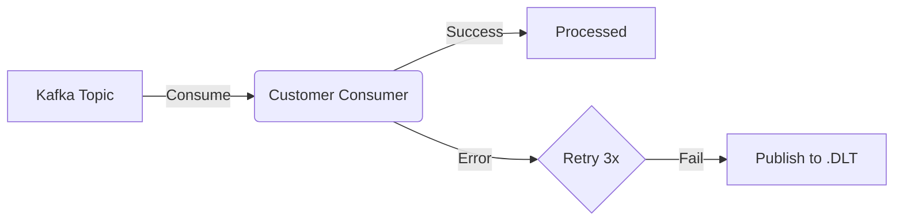

# Customer Service

## Overview
The `customer-service` maintains customer profiles (KYC data), addresses, and contact information. It serves as the source of truth for user identity details beyond authentication credentials.

## Key Features
- **Profile Management**: CRUD operations for customer details.
- **KYC Verification**: Stores document references (simulated).

## Tech Stack
- **Database**: MySQL
- **Framework**: Spring Boot

## API Flow

## Error Handling & Reliability
### Dead Letter Topic (DLT)
This service consumes user creation events and implements DLT for robust error handling.
- **Retry Policy**: 3 attempts with 1-second backoff.
- **DLT Topic**: `bank.user.event.v1.DLT`
- **Mechanism**: Auto-ack enabled, allowing exceptions to propagate to the `DeadLetterPublishingRecoverer`.

