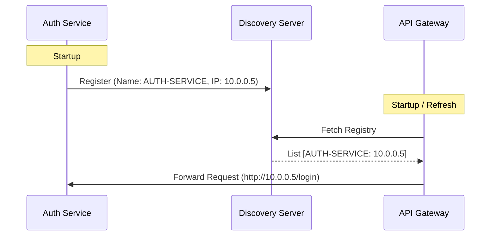

# Discovery Service (Eureka)

## Overview
The `discovery-service` is the Service Registry for the Elevens Bank microservices ecosystem. It uses **Netflix Eureka** to allow services to register themselves and discover other services dynamically without hardcoded IP addresses.

## Key Features
- **Service Registration**: Services register their Host and Port on startup.
- **Heartbeats**: Services send periodic heartbeats (default 30s) to renew their lease.
- **Client-Side Load Balancing**: Clients (like API Gateway) fetch the registry and load balance requests locally.

## Tech Stack
- **Framework**: Spring Cloud Netflix Eureka Server

## Flow Diagrams

### Service Registration & Discovery

