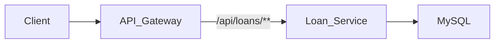

# Loan Service

## Overview
The `loan-service` manages the lifecycle of loans, from application to repayment. It calculates interest, schedules repayments, and tracks outstanding balances.

## Key Features
- **Loan Application**: Apply for Personal, Home, or Car loans.
- **Repayment Schedule**: Auto-generate EMI schedules.
- **Status Tracking**: Track active, closed, or defaulted loans.

## Tech Stack
- **Database**: MySQL
- **Framework**: Spring Boot

## API Flow

