# 🛑 Dead Letter Topic (DLT) Implementation

## Overview
This document outlines the **Dead Letter Topic (DLT)** strategy implemented across the Elevens Bank microservices. The DLT pattern prevents data loss by capturing messages that fail to process after multiple retries, moving them to a dedicated topic for storage and manual inspection.

## 🏗 Architecture
We leverage **Spring Kafka**'s built-in `DeadLetterPublishingRecoverer` and `DefaultErrorHandler`.

### 🔄 The Flow
1.  **Consumer** receives a message.
2.  **Process**: Attempts to process the message.
3.  **Error**: If an exception is thrown, the **Error Handler** catches it.
4.  **Retry**: The handler retries the message **3 times** (with 1 second backoff).
5.  **Failure**: If all retries fail, the **Recoverer** publishes the message to the **DLT**.

```mermaid
sequenceDiagram
    participant P as Producer
    participant K as Kafka Topic
    participant C as Consumer Service
    participant DLT as Kafka DLT (.DLT)

    P->>K: Publish Message
    K->>C: Consume Message
    
    alt Successful Processing
        C->>C: Process Message ✅
        C-->>K: Commit Offset
    else Processing Fails
        C->>C: Exception Thrown ❌
        loop Retry Policy (3x)
            C->>C: Wait 1s & Retry
        end
        
        alt All Retries Failed
            C->>DLT: Publish to <topic>.DLT 📨
            C-->>K: Commit Offset (Move on)
            Note right of DLT: Message saved for manual review
        end
    end
```

6.  **DLT Topic**: The naming convention is `<original-topic-name>.DLT`.

## 🛠 Service Configuration

### 1. Notification Service
- **Topic**: `bank.notification.event.v1`
- **DLT**: `bank.notification.event.v1.DLT`
- **Config**: `KafkaConsumerConfig.java`

### 2. Account Service
- **Topic**: `customer.events`
- **DLT**: `customer.events.DLT`
- **Config**: `KafkaConsumerConfig.java`

### 3. Customer Service
- **Topic**: `bank.user.event.v1`
- **DLT**: `bank.user.event.v1.DLT`
- **Note**: Switched from **Manual ACK** to **Auto ACK** to enable automatic exception propagation to the Error Handler.

## 🩹 Recovery/Redrive
To re-process messages from the DLT, you can:
1.  **Manual script**: Read from `.DLT` and republish to the main topic.
2.  **Kafka Connect**: Use a connector to sink DLT messages to a database for easier UI inspection.

## ⚠️ Important Notes
- **Exceptions**: Consumers **MUST NOT** catch and swallow exceptions. They must throw them to trigger the retry/DLT flow.
- **Topics**: Ensure DLT topics exist in the broker (Kafka `auto.create.topics.enable=true` usually handles this).
