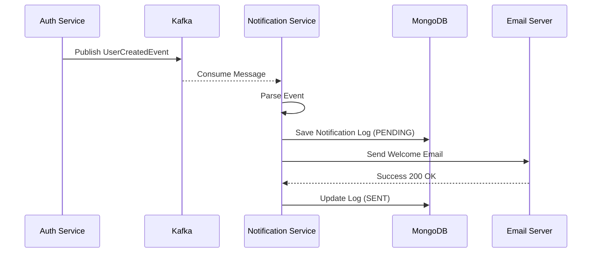
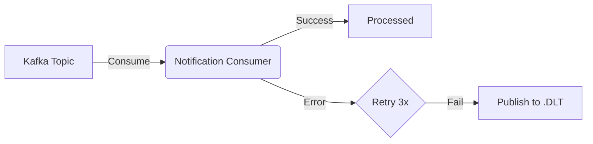

# Notification Service

## Overview
The `notification-service` is responsible for sending alerts and notifications to users. It listens to events from other microservices (like `auth-service` or `transaction-service`) via **Kafka** and processes them asynchronously.

## Key Features
- **Event Driven**: Consumes messages from Kafka topics (e.g., `bank.user.event.v1`).
- **Async Processing**: Decouples email/SMS sending from the core transaction path.
- **Channels**: Supports Email, SMS, and Push Notifications (simulated).

## Tech Stack
- **Messaging**: Apache Kafka
- **Database**: MongoDB (NoSQL) for storing notification logs.

## Flow Diagrams

### Event Consumption Flow

## Error Handling & Reliability
### Dead Letter Topic (DLT)
To ensure **zero data loss**, this service implements a DLT strategy for failed Kafka messages.
- **Retry Policy**: 3 attempts with 1-second backoff.
- **DLT Topic**: `bank.notification.event.v1.DLT`

