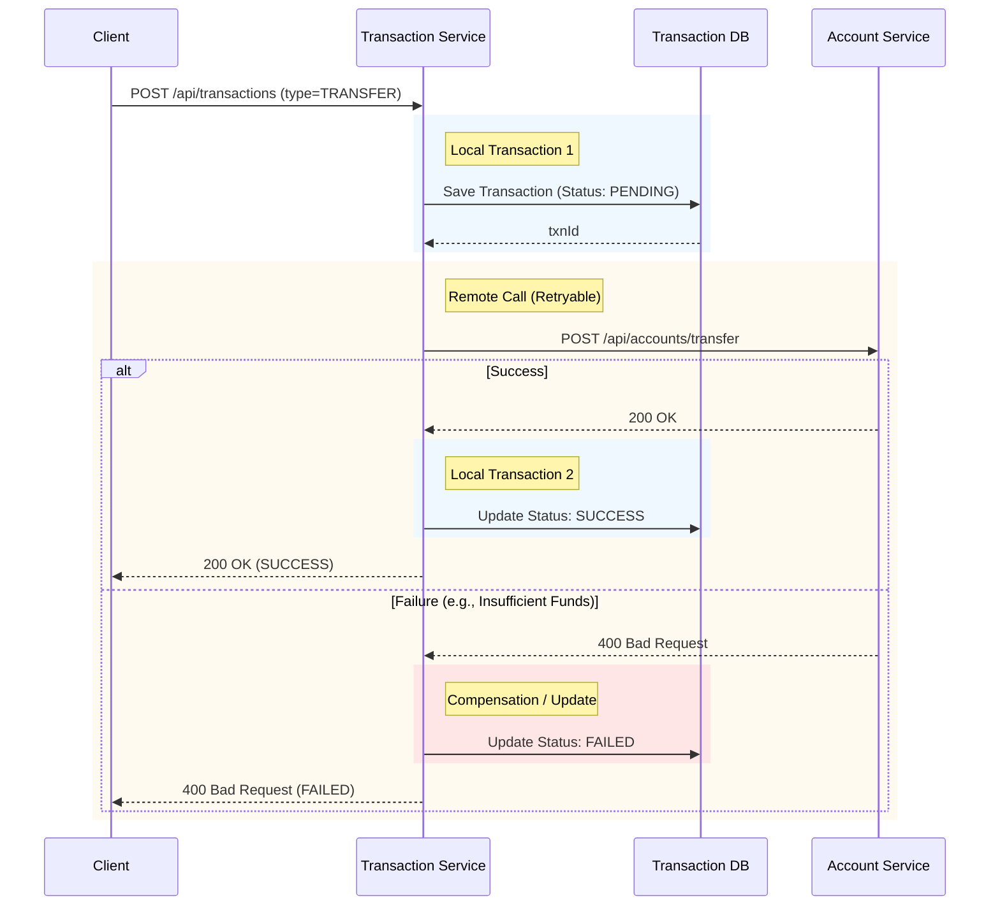

# Transaction Service

## Overview
The `transaction-service` orchestrates financial transactions across the system. It is responsible for initiating transfers, deposits, and withdrawals. It implements the **Saga Pattern** to ensure distributed data consistency between its own ledger and the `account-service`.

## Key Features
- **Saga Orchestration**: Manages the lifecycle of a distributed transaction (Pending -> Success/Failed).
- **Idempotency**: Prevents duplicate transactions using unique Reference IDs.
- **Resiliency**: Uses **Retry Pattern** with Exponential Backoff for transient failures (e.g., network glitches, database locks).
- **History**: Provides transaction history for accounts.

## Tech Stack
- **Database**: MySQL (Stores Transaction Status/Metadata)
- **Communication**: REST Code (FeignClient) to Account Service
- **Resilience**: Spring Retry

## Flow Diagrams

### Distributed Transaction Flow (Saga)
Reflects the `performTransaction` method logic.

